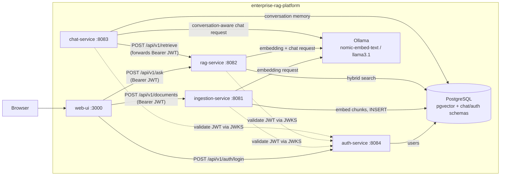
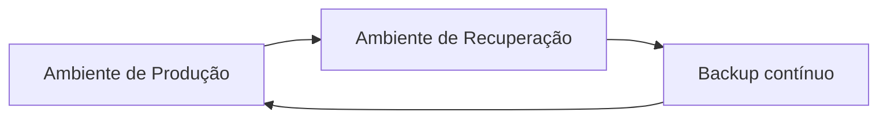

# enterprise-rag-platform

[](https://github.com/eniglio-ctrl/enterprise-rag-platform/actions/workflows/ci.yml)
[](LICENSE)
[](https://openjdk.org/projects/jdk/21/)
[](https://spring.io/projects/spring-boot)

A Retrieval-Augmented Generation platform built like a real backend system, not a
notebook: independent Spring Boot services, a shared Postgres/pgvector store, local-first
inference through Ollama, structured logging, metrics, health checks, and documented
architecture decisions.

**Live demo**: [web-ui-rag.netlify.app](https://web-ui-rag.netlify.app) — a free,
public, no-login instance answering questions from a small pre-seeded document set
about this project itself (Groq for chat, Mistral AI for embeddings, Neon Postgres;
decision rationale in [ADR 0020](docs/adr/0020-public-demo-deployment.md), full
configuration reference and test guide in
[docs/DEMO-DEPLOYMENT.md](docs/DEMO-DEPLOYMENT.md)). The full stack with your own
documents, image/audio ingestion, and every model provider still needs the local
setup below.

Upload a document — a talk transcript, a design doc, meeting notes — and ask it to draw
the architecture or flow it describes: the LLM extracts the components and relationships
straight from the ingested content and returns a rendered Mermaid diagram, no
fixed layout engine involved. Ask a plain question instead and get a text answer with the
exact chunks (source + score) it was grounded in. Both go through the same input box.

## Architecture



`chat-service` isn't wired into `web-ui` yet (`web-ui` still talks to `rag-service`
directly) — it's reachable today via its own API, see
[Multi-turn conversations](#multi-turn-conversations) below.

Full ingestion/query sequence diagrams and the reasoning behind each architectural
choice live in [docs/architecture.md](docs/architecture.md) and [docs/adr](docs/adr).

## Project structure

```
enterprise-rag-platform/
├── platform-common/     # shared CORS/OpenAPI/error-handling/security code (no controllers)
├── auth-service/         # issues RS256 JWTs, exposes JWKS
├── ingestion-service/   # upload, parse, chunk, embed, persist
├── rag-service/          # retrieve, generate, cite
├── chat-service/         # multi-turn conversations with memory, on top of rag-service
├── web-ui/               # browser UI for login + upload + chat (static HTML/CSS/JS, nginx)
├── postgres-pgvector/    # DB init (vector extension)
├── kubernetes/           # Kustomize manifests for a local `kind` cluster
├── observability/        # Prometheus scrape config + Grafana provisioning/dashboards
├── docs/
│   ├── architecture.md
│   └── adr/              # architecture decision records
├── docker-compose.yml
└── pom.xml               # Maven multi-module parent
```

## Tech stack

| Concern            | Choice                                   |
|---------------------|-------------------------------------------|
| Language / runtime  | Java 21, Spring Boot 3.5                  |
| AI orchestration    | Spring AI 1.0 (Ollama models, pgvector store) |
| Vector store        | PostgreSQL 16 + pgvector (HNSW, cosine)   |
| LLM runtime          | Ollama (`nomic-embed-text`, `llama3.1`)   |
| API docs            | springdoc-openapi / Swagger UI            |
| Observability       | Micrometer + Prometheus, Spring Boot structured (ECS) logs, Actuator health |
| Testing             | JUnit 5, Mockito, Testcontainers (Postgres/pgvector) |
| Frontend            | Vanilla HTML/CSS/JS (no build step), served by nginx; Mermaid.js for diagrams |
| Packaging            | Docker, Docker Compose                    |

## Running it

Requirements: Docker and Docker Compose. Nothing else — no API keys, no local JDK/Maven
needed, models are pulled automatically on first boot.

```bash
docker compose up --build
```

First startup takes a few minutes while Ollama pulls `nomic-embed-text` and `llama3.1`
(a few GB). Once healthy:

| Service           | URL                                             |
|-------------------|--------------------------------------------------|
| web-ui            | http://localhost:3000                            |
| auth-service      | http://localhost:8084/swagger-ui.html            |
| ingestion-service | http://localhost:8081/swagger-ui.html            |
| rag-service       | http://localhost:8082/swagger-ui.html            |
| chat-service      | http://localhost:8083/swagger-ui.html            |
| Grafana           | http://localhost:3001 (anonymous viewer access)  |
| Prometheus        | http://localhost:9090                            |

The web UI at `localhost:3000` logs you in (or registers a new account) first —
every document you upload and every question you ask is scoped to your tenant, per
[ADR 0016](docs/adr/0016-auth-service-jwt-oauth2.md). Once authenticated, one box
uploads a file and one box asks anything — a question gets a text answer with
citations, and a request for a diagram/drawing/flow gets a Mermaid diagram instead, all
through the same input. The sections below show the underlying flows via `curl`,
useful for scripting or CI.

### Authenticate

Every endpoint below except `/api/v1/auth/*` and `/.well-known/jwks.json` requires
`Authorization: Bearer <token>` — `auth-service` issues RS256-signed JWTs
(`tenantId`/`userId` claims) and exposes the public key the other three services
validate them against.

```bash
TOKEN=$(curl -s -X POST http://localhost:8084/api/v1/auth/register \
  -H "Content-Type: application/json" \
  -d '{"email": "you@example.com", "password": "supersecret", "tenantId": "acme"}' \
  | python3 -c "import sys,json; print(json.load(sys.stdin)['token'])")
```

Accounts registering with the same `tenantId` share a knowledge base; a different
`tenantId` gets a fully isolated one — retrieval never crosses the boundary.

### Ingest a document

```bash
curl -X POST http://localhost:8081/api/v1/documents \
  -H "Authorization: Bearer $TOKEN" \
  -F "file=@/path/to/aula12.md"
```

```json
{ "documentId": "…", "source": "aula12.md", "pageCount": 1, "chunkCount": 3 }
```

PDF, DOCX, Markdown and plain text all work the same way. Two more file types are
supported by turning them into text first, then flowing through the exact same
chunk → embed → store pipeline:

- **Images** (`.png`/`.jpg`/`.jpeg`/`.gif`/`.webp`) — described by a local
  vision-capable Ollama model (`llava` by default); the description, not the image
  itself, gets indexed. See [ADR 0018](docs/adr/0018-image-ingestion-via-vision-model.md).
- **Audio** (`.mp3`/`.wav`/`.m4a`/`.ogg`/`.flac`) — transcribed by a local Whisper
  server (`onerahmet/openai-whisper-asr-webservice`); the transcript gets indexed.
  See [ADR 0019](docs/adr/0019-audio-ingestion-via-local-whisper.md).

Both are genuinely local — no OpenAI Whisper API key, no cloud vision call.

Every upload is verified before any of the above ever touches it: extension,
declared content type, and actual byte content (a small magic-byte signature
table, not just the filename) all have to agree, or the request is rejected with
`415`/`422` before reaching Tika/PDFBox/Ollama/Whisper. See
[ADR 0022](docs/adr/0022-upload-validation-hardening.md), part of the security
hardening rollout in [ADR 0021](docs/adr/0021-security-hardening-baseline.md) —
full status and remaining phases tracked in
[docs/SECURITY-HARDENING-ROADMAP.md](docs/SECURITY-HARDENING-ROADMAP.md).

### Ask anything

This is what the web UI calls — one endpoint, routes itself to a diagram or a text
answer based on the question.

```bash
curl -X POST http://localhost:8082/api/v1/ask \
  -H "Authorization: Bearer $TOKEN" \
  -H "Content-Type: application/json" \
  -d '{"question": "Draw the disaster recovery architecture described"}'
```

```json
{
  "type": "diagram",
  "answer": null,
  "mermaid": "flowchart LR\n    A[\"Ambiente de Produção\"] --> B[\"Ambiente de Recuperação\"]\n    ...",
  "citations": [ { "source": "aws-dr-talk.txt", "chunkIndex": 3, "score": 0.74, "snippet": "..." } ]
}
```

That transcript never contained a diagram — the LLM read the described setup and
produced this flowchart from scratch:



```bash
curl -X POST http://localhost:8082/api/v1/ask \
  -H "Authorization: Bearer $TOKEN" \
  -H "Content-Type: application/json" \
  -d '{"question": "Como funciona o padrão SAGA?"}'
```

```json
{
  "type": "answer",
  "answer": "O padrão SAGA coordena transações distribuídas... [1]",
  "mermaid": null,
  "citations": [
    { "source": "aula12.md", "chunkIndex": 0, "score": 0.83, "snippet": "O padrão SAGA..." }
  ],
  "groundedness": null
}
```

Add `"grounded": true` to the request to get a second, cheap opinion on whether the
answer is actually backed by the retrieved context (`"groundedness": "SUPPORTED"` or
`"NOT_SUPPORTED"`) — off by default since it's a second LLM call, roughly doubling
latency. See [ADR 0008](docs/adr/0008-groundedness-check.md).

Retrieval already combines pgvector similarity with Postgres full-text search (RRF
fusion) by default — no flag needed, it's a strict quality improvement with no extra
LLM call. Add `"rerank": true` on top for an LLM-as-judge pass over a wider candidate
pool before answering; like `grounded`, it's a full extra Ollama call so it's opt-in.
See [ADR 0012](docs/adr/0012-hybrid-search-rrf-llm-rerank.md).

Routing is a plain keyword check on the question (mentions of "diagram", "draw", "flow",
"architecture", etc.) rather than an extra LLM call, so it's fast and predictable. The
underlying single-purpose endpoints (`/api/v1/chat`, `/api/v1/diagrams`) still exist too,
useful when a caller already knows which one it wants:

```bash
curl -X POST http://localhost:8082/api/v1/chat \
  -H "Authorization: Bearer $TOKEN" \
  -H "Content-Type: application/json" \
  -d '{"question": "Como funciona o padrão SAGA?"}'

curl -X POST http://localhost:8082/api/v1/diagrams \
  -H "Authorization: Bearer $TOKEN" \
  -H "Content-Type: application/json" \
  -d '{"question": "Draw the disaster recovery architecture described"}'
```

You can also attach an image (PNG/JPEG/GIF/WebP) directly to a single question — the
📎 icon in the web UI's ask box (or just paste a screenshot with Cmd/Ctrl+V straight
into the question box), or `multipart/form-data` against the same `/api/v1/ask`
endpoint:

```bash
curl -X POST http://localhost:8082/api/v1/ask \
  -H "Authorization: Bearer $TOKEN" \
  -F "question=What does this diagram show?" \
  -F "image=@/path/to/screenshot.png;type=image/png"
```

A vision model (Ollama's `llava` locally, Mistral's Pixtral on the public demo —
Groq, the demo's text-chat provider, has no vision model) describes the image once
and folds that description into just this question's context — the image itself is
never stored or indexed, unlike an uploaded image *document* (ADR 0018). See
[ADR 0023](docs/adr/0023-ephemeral-image-attachment-on-ask.md).

### Picking a chat model (Ollama + LM Studio)

`GET /api/v1/models` lists the chat models configured in `rag.available-models`
(`application.yml`) — the web-ui's dropdown renders exactly this list, nothing
hardcoded client-side. Pass `"model"` in any `/api/v1/ask`/`/chat`/`/diagrams`
request to override the default for that one call:

```bash
curl http://localhost:8082/api/v1/models -H "Authorization: Bearer $TOKEN"

curl -X POST http://localhost:8082/api/v1/ask \
  -H "Authorization: Bearer $TOKEN" -H "Content-Type: application/json" \
  -d '{"question": "Como funciona o padrão SAGA?", "model": "llama3.2"}'
```

Out of the box this lists **"Automático (recomendado)"** first (pre-selected), two
Ollama models (the actual default it resolves to, plus `llama3.2` — pull it first
with `ollama pull llama3.2` to actually use it), and one
[LM Studio](https://lmstudio.ai) entry, which talks to LM Studio's local
OpenAI-compatible server (`http://localhost:1234` by default) if it's running with a
model loaded. "Automático" is a sentinel, not a real model — today it just resolves
to the same configured default (there isn't yet a real pool of distinct providers
worth choosing between intelligently); see
[ADR 0025](docs/adr/0025-auto-model-selection.md) and
[docs/MULTI-LLM-ORCHESTRATOR-ROADMAP.md](docs/MULTI-LLM-ORCHESTRATOR-ROADMAP.md)
for where that's headed. An unknown/unreachable model id falls back to the default
rather than erroring the whole question. See
[ADR 0017](docs/adr/0017-selectable-chat-model-ollama-lmstudio.md) for how two
`ChatModel` providers coexist on the same classpath without conflict.

`mermaid` is a ready-to-render [Mermaid.js](https://mermaid.js.org/) flowchart definition;
the web UI renders it directly with `mermaid.render(...)`. If the retrieved content
doesn't describe an architecture, process or flow, `mermaid` comes back as a single
"insufficient data" node instead of a fabricated diagram.

### Multi-turn conversations

`chat-service` (port 8083) delegates retrieval to `rag-service` and adds conversation
memory on top — it never re-implements embedding or search itself. See
[ADR 0013](docs/adr/0013-chat-service-conversation-memory.md).

```bash
CONVERSATION_ID=$(curl -s -X POST http://localhost:8083/api/v1/conversations \
  -H "Authorization: Bearer $TOKEN" \
  | python3 -c "import sys,json; print(json.load(sys.stdin)['conversationId'])")

curl -X POST http://localhost:8083/api/v1/conversations/$CONVERSATION_ID/messages \
  -H "Authorization: Bearer $TOKEN" \
  -H "Content-Type: application/json" \
  -d '{"message": "Como funciona o padrão SAGA?"}'

curl http://localhost:8083/api/v1/conversations/$CONVERSATION_ID/messages \
  -H "Authorization: Bearer $TOKEN"
```

### Running on Kubernetes (local)

Kustomize manifests (`kubernetes/base/`) run the full stack in a local `kind` cluster —
`StatefulSet`s for Postgres/Ollama, `Deployment`s for the four application services,
Secrets via `kustomize`'s `secretGenerator` (never committed), and an initContainer
wait-loop pattern standing in for docker-compose's `depends_on: condition:
service_healthy`. See [kubernetes/README.md](kubernetes/README.md) for the full
walkthrough and [ADR 0014](docs/adr/0014-kubernetes-manifests-kind.md) for the design
decisions (and two real bugs found bringing it up).

```bash
kind create cluster --name rag-platform
kind load docker-image rag-platform/ingestion-service:latest \
  rag-platform/rag-service:latest rag-platform/chat-service:latest \
  rag-platform/web-ui:latest --name rag-platform
cp kubernetes/base/.env.secret.example kubernetes/base/.env.secret  # edit with real values
kubectl apply -k kubernetes/base
kubectl port-forward -n rag-platform svc/web-ui 3000:80
```

### Observability

Prometheus scrapes `/actuator/prometheus` from all three Java services every 10s;
Grafana auto-provisions a datasource and a dashboard on startup — nothing to configure
by hand. The **RAG Platform Overview** dashboard (`http://localhost:3001`) has three
rows: HTTP (request rate, p95 latency, error rate, per service), JVM (heap, GC pause),
and business metrics (documents ingested, chunks created, answers vs. diagrams
generated, chat messages exchanged, average generation time per operation). See
[ADR 0015](docs/adr/0015-observability-stack.md) for the design decisions.

## Running the tests

```bash
./mvnw test          # unit tests, no external dependencies
./mvnw verify         # includes Testcontainers integration tests — needs Docker
```

Integration tests spin up a real Postgres container per module (`pgvector/pgvector:pg16`
for `ingestion-service`/`rag-service`, plain `postgres:16` for `chat-service` — it never
touches the vector extension) and mock only the Ollama-backed models, so the real
ingestion → chunk → embed → store → retrieve → converse path is exercised against a real
database, not a fake.

### RAG quality benchmark

A separate, opt-in benchmark scores real answer quality — not mocked models — against
10 question/expected-answer pairs, via cosine similarity between each generated
answer's embedding and its expected answer's (reusing the same `EmbeddingModel` bean
the app already injects, no new dependency). It needs a real, reachable local Ollama
with `llama3.1` and `nomic-embed-text` already pulled, so it's excluded from both
`verify` and CI:

```bash
./mvnw test -pl rag-service -Dtest=RagQualityBenchmark -Dbenchmark=true \
    -Dsurefire.failIfNoSpecifiedTests=false
```

Latest real run: **average similarity 0.651** across 10 questions (minimum bar:
0.60), individual scores 0.47–0.93. Several answers came back in Portuguese for
English questions — a genuine, CPU-bound `llama3.1` quirk on this hardware, not a
retrieval defect — which cross-lingual cosine similarity penalizes even when the
answer is factually correct; see the class's own Javadoc for the full account,
including a real, reproducible gotcha (a second, unrelated local Ollama process
competing for port 11434) that looked like test flakiness before it was tracked
down.

## What's implemented vs. what's next

This is a deliberately shipped **vertical slice**: `ingestion-service`, `rag-service`,
`chat-service` and `auth-service` are fully working end to end, rather than six
half-built modules. What's next:

- **Kubernetes manifests second pass** — the manifests in `kubernetes/base/` (ADR 0014)
  were built before `auth-service` existed, a deliberate, documented deviation from the
  original phase order. They need a fifth Deployment+Service for `auth-service` and an
  `AUTH_SERVICE_BASE_URL` wired into the other three.
- **Security hardening rollout** (ADR 0021) — a layered pass in progress: upload
  content validation is done (ADR 0022); rate limiting, secrets/CORS/headers,
  a real tenant/invitation model with a persistent JWT signing key, security
  audit logging, and public-demo hardening are next. Full phase-by-phase status:
  [docs/SECURITY-HARDENING-ROADMAP.md](docs/SECURITY-HARDENING-ROADMAP.md).
- **Signing-key persistence** — `auth-service` generates its RSA keypair in memory on
  every restart (ADR 0016); tokens issued before a restart stop validating after one.
  Fine for a demo, not for a real deployment. Being replaced as part of the
  security hardening rollout above.
- **Multi-LLM orchestrator + broader AI-engineering roadmap** — an "Automático"
  model selector is done (ADR 0025); real cloud providers, a planner/reflection
  agent pair, native tool calling, MCP tools, RAG chunking-strategy/evaluation-metric
  upgrades, event-driven architecture, an AWS deployment target, a Python/LangGraph
  agent layer, and LLM-specific observability (LangFuse/OpenTelemetry) are a much
  larger, explicitly staged initiative — see
  [docs/MULTI-LLM-ORCHESTRATOR-ROADMAP.md](docs/MULTI-LLM-ORCHESTRATOR-ROADMAP.md).
  Every phase past the selector is blocked on a real decision (which paid API(s), is
  Redis/Kafka actually justified, which MCP tools, whether a second language is
  worth it) before any code gets written for it.
- ~~A quality benchmark~~ — done: see [RAG quality benchmark](#rag-quality-benchmark)
  above.
- ~~Public deploy~~ — done and live: [web-ui-rag.netlify.app](https://web-ui-rag.netlify.app)
  (ADR 0020: Groq for chat via the same pluggable-provider mechanism as ADR 0017,
  Mistral AI's free embedding API, Render + Neon + Netlify, a demo-only no-login
  security profile).

## Architecture decisions

- [ADR 0001 — PostgreSQL + pgvector as the vector store](docs/adr/0001-postgres-pgvector-as-vector-store.md)
- [ADR 0002 — Shared database between services (MVP simplification)](docs/adr/0002-shared-database-between-services.md)
- [ADR 0003 — Ollama for local-first inference](docs/adr/0003-ollama-for-local-first-inference.md)
- [ADR 0004 — Citations from retrieval, not from the LLM](docs/adr/0004-citations-from-retrieval-not-llm.md)
- [ADR 0005 — LLM-generated Mermaid diagrams instead of a fixed layout engine](docs/adr/0005-mermaid-for-generated-diagrams.md)
- [ADR 0006 — Single "ask" endpoint with keyword-based routing](docs/adr/0006-unified-ask-endpoint-with-keyword-routing.md)
- [ADR 0007 — Tenancy data contract (tenantId + userId); real authentication came later in ADR 0016](docs/adr/0007-tenancy-data-contract.md)
- [ADR 0008 — Opt-in groundedness check as a second LLM call](docs/adr/0008-groundedness-check.md)
- [ADR 0009 — Retry + circuit breaker around every Ollama call](docs/adr/0009-resilience4j-retry-circuit-breaker.md)
- [ADR 0010 — Extract `platform-common` for the code every service duplicated](docs/adr/0010-platform-common-module.md)
- [ADR 0011 — Flyway takes over schema creation from PgVectorStore's auto-init](docs/adr/0011-flyway-schema-migrations.md)
- [ADR 0012 — Hybrid search (vector + full-text via RRF), opt-in LLM rerank](docs/adr/0012-hybrid-search-rrf-llm-rerank.md)
- [ADR 0013 — chat-service: conversation memory on top of rag-service's retrieval](docs/adr/0013-chat-service-conversation-memory.md)
- [ADR 0014 — Kubernetes manifests for local `kind` deployment](docs/adr/0014-kubernetes-manifests-kind.md)
- [ADR 0015 — Observability stack (Prometheus + Grafana)](docs/adr/0015-observability-stack.md)
- [ADR 0016 — auth-service: RS256 JWTs, JWKS, and the transition from trusted headers](docs/adr/0016-auth-service-jwt-oauth2.md)
- [ADR 0017 — Per-request chat model picker (Ollama models + LM Studio)](docs/adr/0017-selectable-chat-model-ollama-lmstudio.md)
- [ADR 0018 — Image ingestion via a local vision model](docs/adr/0018-image-ingestion-via-vision-model.md)
- [ADR 0019 — Audio ingestion via a local Whisper server; the real root cause of an early transport bug](docs/adr/0019-audio-ingestion-via-local-whisper.md)
- [ADR 0020 — Free public demo deployment (Groq + Mistral AI embeddings + Render + Neon)](docs/adr/0020-public-demo-deployment.md)
- [ADR 0021 — Security hardening baseline (the layered rollout this and the following ADRs are part of)](docs/adr/0021-security-hardening-baseline.md)
- [ADR 0022 — Upload content validation via magic bytes](docs/adr/0022-upload-validation-hardening.md)
- [ADR 0023 — Ephemeral image attachment on `/api/v1/ask`](docs/adr/0023-ephemeral-image-attachment-on-ask.md)
- [ADR 0024 — Replace keyword-based `/api/v1/ask` routing with an LLM classification call](docs/adr/0024-llm-based-ask-routing.md)
- [ADR 0025 — "Automático" as a sentinel entry in `rag.available-models`](docs/adr/0025-auto-model-selection.md)

## License

[MIT](LICENSE)
