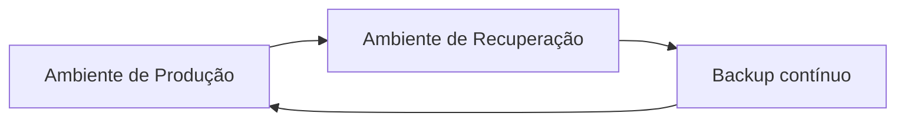

# enterprise-rag-platform

[](https://github.com/eniglio-ctrl/enterprise-rag-platform/actions/workflows/ci.yml)
[](LICENSE)
[](https://openjdk.org/projects/jdk/21/)
[](https://spring.io/projects/spring-boot)

A Retrieval-Augmented Generation platform built like a real backend system, not a
notebook: independent Spring Boot services, a shared Postgres/pgvector store, local-first
inference through Ollama, structured logging, metrics, health checks, and documented
architecture decisions.

Upload a document — a talk transcript, a design doc, meeting notes — and ask it to draw
the architecture or flow it describes: the LLM extracts the components and relationships
straight from the ingested content and returns a rendered Mermaid diagram, no
fixed layout engine involved. Ask a plain question instead and get a text answer with the
exact chunks (source + score) it was grounded in. Both go through the same input box.

## Architecture


Full ingestion/query sequence diagrams and the reasoning behind each architectural
choice live in [docs/architecture.md](docs/architecture.md) and [docs/adr](docs/adr).

## Project structure

```
enterprise-rag-platform/
├── platform-common/     # shared CORS/OpenAPI/error-handling code (no controllers)
├── ingestion-service/   # upload, parse, chunk, embed, persist
├── rag-service/          # retrieve, generate, cite
├── web-ui/               # browser UI for upload + chat (static HTML/CSS/JS, nginx)
├── postgres-pgvector/    # DB init (vector extension)
├── docs/
│   ├── architecture.md
│   └── adr/              # architecture decision records
├── docker-compose.yml
└── pom.xml               # Maven multi-module parent
```

## Tech stack

| Concern            | Choice                                   |
|---------------------|-------------------------------------------|
| Language / runtime  | Java 21, Spring Boot 3.5                  |
| AI orchestration    | Spring AI 1.0 (Ollama models, pgvector store) |
| Vector store        | PostgreSQL 16 + pgvector (HNSW, cosine)   |
| LLM runtime          | Ollama (`nomic-embed-text`, `llama3.1`)   |
| API docs            | springdoc-openapi / Swagger UI            |
| Observability       | Micrometer + Prometheus, Spring Boot structured (ECS) logs, Actuator health |
| Testing             | JUnit 5, Mockito, Testcontainers (Postgres/pgvector) |
| Frontend            | Vanilla HTML/CSS/JS (no build step), served by nginx; Mermaid.js for diagrams |
| Packaging            | Docker, Docker Compose                    |

## Running it

Requirements: Docker and Docker Compose. Nothing else — no API keys, no local JDK/Maven
needed, models are pulled automatically on first boot.

```bash
docker compose up --build
```

First startup takes a few minutes while Ollama pulls `nomic-embed-text` and `llama3.1`
(a few GB). Once healthy:

| Service           | URL                                             |
|-------------------|--------------------------------------------------|
| web-ui            | http://localhost:3000                            |
| ingestion-service | http://localhost:8081/swagger-ui.html            |
| rag-service       | http://localhost:8082/swagger-ui.html            |

The web UI at `localhost:3000` has one box to upload a file and one box to ask
anything — a question gets a text answer with citations, and a request for a
diagram/drawing/flow gets a Mermaid diagram instead, all through the same input. The
sections below show the underlying flows via `curl`, useful for scripting or CI.

### Ingest a document

```bash
curl -X POST http://localhost:8081/api/v1/documents \
  -F "file=@/path/to/aula12.md"
```

```json
{ "documentId": "…", "source": "aula12.md", "pageCount": 1, "chunkCount": 3 }
```

### Ask anything

This is what the web UI calls — one endpoint, routes itself to a diagram or a text
answer based on the question.

```bash
curl -X POST http://localhost:8082/api/v1/ask \
  -H "Content-Type: application/json" \
  -d '{"question": "Draw the disaster recovery architecture described"}'
```

```json
{
  "type": "diagram",
  "answer": null,
  "mermaid": "flowchart LR\n    A[\"Ambiente de Produção\"] --> B[\"Ambiente de Recuperação\"]\n    ...",
  "citations": [ { "source": "aws-dr-talk.txt", "chunkIndex": 3, "score": 0.74, "snippet": "..." } ]
}
```

That transcript never contained a diagram — the LLM read the described setup and
produced this flowchart from scratch:



```bash
curl -X POST http://localhost:8082/api/v1/ask \
  -H "Content-Type: application/json" \
  -d '{"question": "Como funciona o padrão SAGA?"}'
```

```json
{
  "type": "answer",
  "answer": "O padrão SAGA coordena transações distribuídas... [1]",
  "mermaid": null,
  "citations": [
    { "source": "aula12.md", "chunkIndex": 0, "score": 0.83, "snippet": "O padrão SAGA..." }
  ],
  "groundedness": null
}
```

Add `"grounded": true` to the request to get a second, cheap opinion on whether the
answer is actually backed by the retrieved context (`"groundedness": "SUPPORTED"` or
`"NOT_SUPPORTED"`) — off by default since it's a second LLM call, roughly doubling
latency. See [ADR 0008](docs/adr/0008-groundedness-check.md).

Routing is a plain keyword check on the question (mentions of "diagram", "draw", "flow",
"architecture", etc.) rather than an extra LLM call, so it's fast and predictable. The
underlying single-purpose endpoints (`/api/v1/chat`, `/api/v1/diagrams`) still exist too,
useful when a caller already knows which one it wants:

```bash
curl -X POST http://localhost:8082/api/v1/chat \
  -H "Content-Type: application/json" \
  -d '{"question": "Como funciona o padrão SAGA?"}'

curl -X POST http://localhost:8082/api/v1/diagrams \
  -H "Content-Type: application/json" \
  -d '{"question": "Draw the disaster recovery architecture described"}'
```

`mermaid` is a ready-to-render [Mermaid.js](https://mermaid.js.org/) flowchart definition;
the web UI renders it directly with `mermaid.render(...)`. If the retrieved content
doesn't describe an architecture, process or flow, `mermaid` comes back as a single
"insufficient data" node instead of a fabricated diagram.

## Running the tests

```bash
./mvnw test          # unit tests, no external dependencies
./mvnw verify         # includes Testcontainers integration tests — needs Docker
```

Integration tests spin up a real `pgvector/pgvector:pg16` container per module and mock
only the Ollama-backed models, so the ingestion → chunk → embed → store → retrieve path
is exercised against a real database, not a fake.

## What's implemented vs. what's next

This is a deliberately shipped **vertical slice**: `ingestion-service` and `rag-service`
are fully working end to end, rather than six half-built modules. What's next:

- **chat-service** — multi-turn conversations with memory (Spring AI `ChatMemory`),
  sitting in front of `rag-service`.
- **auth-service** — JWT/OAuth2, so ingestion and chat are per-user/per-tenant.
- **Hybrid search + re-ranking** — combine pgvector similarity with Postgres full-text
  (`tsvector`) search, re-rank the merged candidates with a cross-encoder.
- **Kubernetes manifests** — Deployments, Services, ConfigMaps, HPA for each service.
- **Grafana dashboards** on top of the Prometheus metrics already exposed by both
  services.

## Architecture decisions

- [ADR 0001 — PostgreSQL + pgvector as the vector store](docs/adr/0001-postgres-pgvector-as-vector-store.md)
- [ADR 0002 — Shared database between services (MVP simplification)](docs/adr/0002-shared-database-between-services.md)
- [ADR 0003 — Ollama for local-first inference](docs/adr/0003-ollama-for-local-first-inference.md)
- [ADR 0004 — Citations from retrieval, not from the LLM](docs/adr/0004-citations-from-retrieval-not-llm.md)
- [ADR 0005 — LLM-generated Mermaid diagrams instead of a fixed layout engine](docs/adr/0005-mermaid-for-generated-diagrams.md)
- [ADR 0006 — Single "ask" endpoint with keyword-based routing](docs/adr/0006-unified-ask-endpoint-with-keyword-routing.md)
- [ADR 0007 — Tenancy data contract (tenantId + userId), without real authentication yet](docs/adr/0007-tenancy-data-contract.md)
- [ADR 0008 — Opt-in groundedness check as a second LLM call](docs/adr/0008-groundedness-check.md)
- [ADR 0009 — Retry + circuit breaker around every Ollama call](docs/adr/0009-resilience4j-retry-circuit-breaker.md)
- [ADR 0010 — Extract `platform-common` for the code every service duplicated](docs/adr/0010-platform-common-module.md)

## License

[MIT](LICENSE)
