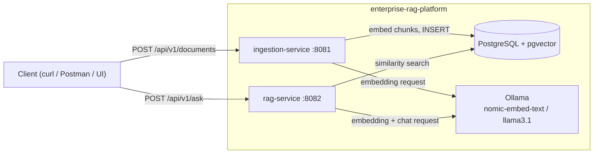
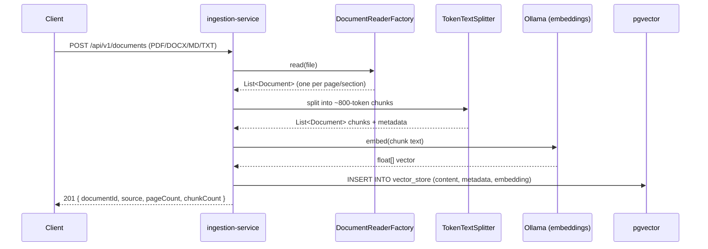
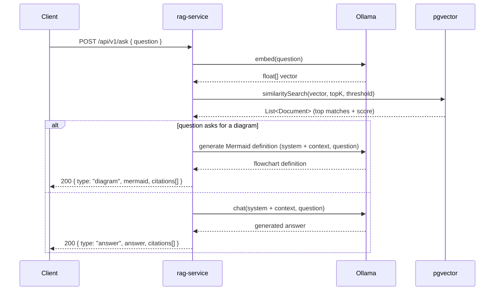

# Architecture

## Overview

Both services are independent Spring Boot applications that share one Postgres/pgvector
instance: `ingestion-service` writes to the `vector_store` table, `rag-service` only reads
from it. See [ADR 0002](adr/0002-shared-database-between-services.md) for why this
coupling is an accepted MVP tradeoff rather than the target end state.

## Ingestion flow

## Query flow

`POST /api/v1/ask` is a single entry point: `rag-service` checks the question for
diagram-intent keywords ("diagram", "draw", "flow", "architecture", ...) and routes to
either a text answer or a Mermaid diagram — see
[ADR 0006](adr/0006-unified-ask-endpoint-with-keyword-routing.md). The underlying
single-purpose endpoints (`/api/v1/chat`, `/api/v1/diagrams`) still exist for callers
that already know which one they want.

Citations in the response are built directly from the documents the vector search
returned (source file, chunk index, similarity score) rather than parsed out of the
LLM's free-text answer — see [ADR 0004](adr/0004-citations-from-retrieval-not-llm.md).
