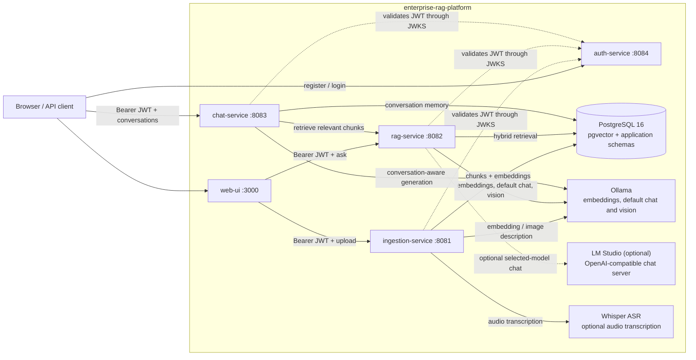
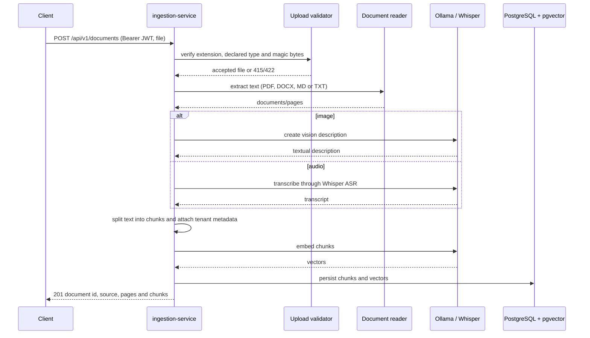
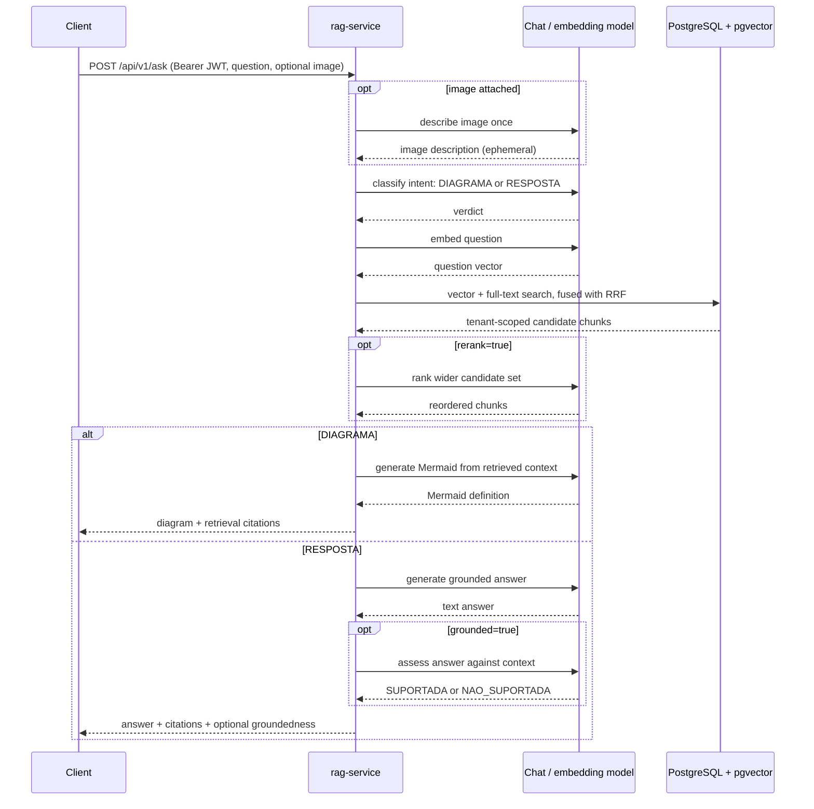
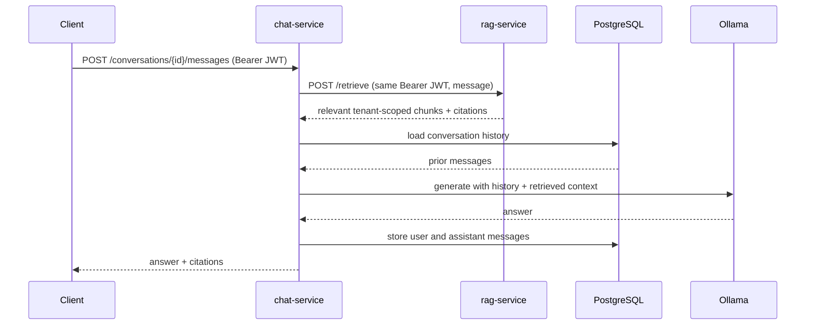

# Architecture

## Overview

`enterprise-rag-platform` is a local-first RAG platform composed of four Spring Boot
services, a static web UI, PostgreSQL/pgvector, and local AI runtimes. The browser
talks directly to the service that owns each capability; `chat-service` is currently
available through its own API and is not yet wired into `web-ui`.

`auth-service` issues RS256 JWTs containing `tenantId` and `userId`; the other three
Spring services act as resource servers and validate those tokens using its JWKS
endpoint. Retrieval and conversations are tenant-scoped. See
[ADR 0016](adr/0016-auth-service-jwt-oauth2.md) and
[ADR 0007](adr/0007-tenancy-data-contract.md).

Ollama is the default local runtime and is responsible for embeddings and vision. LM
Studio is optional: when its model is selected for a request, `rag-service` calls its
locally running OpenAI-compatible server for chat generation, while embeddings remain
on Ollama. See [ADR 0017](adr/0017-selectable-chat-model-ollama-lmstudio.md) and
[ADR 0025](adr/0025-auto-model-selection.md).

`platform-common` contains shared CORS, OpenAPI, error-handling, resilience and
resource-server security code. PostgreSQL deliberately remains shared while the system
is at portfolio/MVP scale; this is a documented trade-off, not an accidental boundary.
See [ADR 0010](adr/0010-platform-common-module.md) and
[ADR 0002](adr/0002-shared-database-between-services.md).

## Ingestion flow

The original binary image is not indexed: its vision-generated description is. Audio is
transcribed before it enters the same chunk/embed/store pipeline. Validation happens
before parsers or models receive the upload. See [ADR 0018](adr/0018-image-ingestion-via-vision-model.md),
[ADR 0019](adr/0019-audio-ingestion-via-local-whisper.md), and
[ADR 0022](adr/0022-upload-validation-hardening.md).

## Query flow

`POST /api/v1/ask` is the web UI's unified entry point. It first asks the resolved chat
model for a temperature-0, one-word intent classification: `DIAGRAMA` or `RESPOSTA`.
This replaced the original keyword router after an image question was incorrectly sent
to diagram generation. Callers that already know the operation can use `/api/v1/chat`
or `/api/v1/diagrams` directly.

Citations are built from the chunks actually retrieved, rather than parsed from model
output. Hybrid retrieval uses pgvector similarity and PostgreSQL full-text search fused
with reciprocal-rank fusion (RRF); optional LLM reranking and groundedness checks add
extra model calls. See [ADR 0004](adr/0004-citations-from-retrieval-not-llm.md),
[ADR 0012](adr/0012-hybrid-search-rrf-llm-rerank.md),
[ADR 0008](adr/0008-groundedness-check.md), and
[ADR 0024](adr/0024-llm-based-ask-routing.md).

## Multi-turn conversation flow

`chat-service` owns conversation lifecycle and memory. It does not duplicate RAG
retrieval: for every message it forwards the caller's bearer token to `rag-service`'s
retrieval-only endpoint, then generates a response using the retrieved context plus the
conversation history stored in PostgreSQL.

See [ADR 0013](adr/0013-chat-service-conversation-memory.md).
