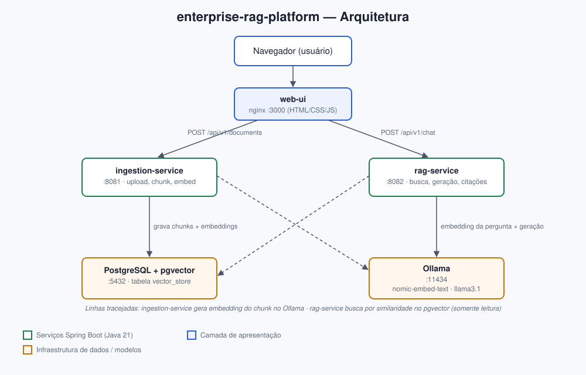

# Documentação — enterprise-rag-platform

## 1. Visão geral

O **enterprise-rag-platform** é uma plataforma de RAG (Retrieval-Augmented Generation)
construída como um sistema corporativo real, e não como um notebook de tutorial:
microsserviços independentes em Java/Spring Boot, banco vetorial PostgreSQL + pgvector,
inferência local via Ollama (sem depender de API paga/externa), interface web, logs
estruturados, métricas, health checks e documentação de decisões de arquitetura (ADRs).

Na prática, o sistema permite:

1. Fazer upload de um documento (PDF, DOCX, Markdown ou texto puro).
2. O documento é automaticamente extraído, dividido em pedaços ("chunks"), transformado
   em vetores (embeddings) e indexado no PostgreSQL/pgvector — sem nenhuma ação manual
   adicional.
3. Fazer uma pergunta em linguagem natural sobre o conteúdo enviado e receber uma
   resposta gerada por LLM, **com citação exata da fonte** (arquivo, número do chunk e
   score de similaridade).

## 2. Diagrama de arquitetura



O sistema é composto por 5 peças rodando em containers Docker separados:

| Componente          | Papel                                                             | Porta |
|----------------------|--------------------------------------------------------------------|-------|
| `web-ui`             | Interface web (upload + chat) — HTML/CSS/JS puro servido por nginx | 3000  |
| `ingestion-service`  | Recebe upload, extrai texto, gera embeddings, grava no pgvector    | 8081  |
| `rag-service`        | Busca por similaridade, monta contexto, gera resposta com citações| 8082  |
| PostgreSQL + pgvector| Armazena os chunks e seus vetores de embedding                    | 5432  |
| Ollama               | Executa os modelos de IA localmente (embedding e chat)            | 11434 |

**Ponto importante sobre a indexação automática**: não existe um botão ou endpoint
separado de "indexar". A indexação no pgvector acontece dentro da própria requisição de
upload — o `ingestion-service` extrai o texto, gera o embedding via Ollama e grava no
banco antes mesmo de responder ao cliente. Assim que o upload retorna sucesso, o
conteúdo já está pesquisável.

## 3. Funcionalidades

- Upload de PDF, DOCX, Markdown e texto puro.
- Indexação automática (chunking + embedding + persistência) a cada upload.
- Busca por similaridade vetorial no PostgreSQL/pgvector (índice HNSW, distância cosseno).
- Geração de resposta com LLM local (Ollama), respondendo no mesmo idioma da pergunta.
- Citação das fontes usadas na resposta — calculada a partir do que foi realmente
  recuperado na busca, não a partir do texto gerado pelo modelo (evita citação
  "alucinada"; ver seção 7).
- API REST documentada com OpenAPI/Swagger em cada serviço.
- Interface web para upload e chat, sem necessidade de `curl`/Postman.
- Logs estruturados (formato ECS), métricas Prometheus e health checks em ambos os
  serviços Java.
- Testes unitários e de integração (estes últimos com Testcontainers, subindo um
  PostgreSQL/pgvector real durante os testes).

## 4. Tecnologias utilizadas

| Camada                | Tecnologia |
|------------------------|------------|
| Linguagem / runtime    | Java 21, Spring Boot 3.5 |
| Orquestração de IA     | Spring AI 1.0 (integração com Ollama e pgvector) |
| Banco vetorial         | PostgreSQL 16 + extensão pgvector |
| Modelos de IA          | Ollama — `nomic-embed-text` (embeddings) e `llama3.1` (chat) |
| Frontend               | HTML/CSS/JS puro (sem framework, sem build), servido por nginx |
| Documentação de API    | springdoc-openapi / Swagger UI |
| Observabilidade        | Micrometer + Prometheus, logs estruturados (ECS), Spring Boot Actuator |
| Testes                 | JUnit 5, Mockito, Testcontainers |
| Empacotamento          | Docker, Docker Compose |
| Build                  | Maven (projeto multi-módulo, com Maven Wrapper) |

## 5. Fluxo de ingestão (upload → indexação)

1. O usuário envia um arquivo pela interface web (ou via `POST /api/v1/documents`).
2. O `ingestion-service` identifica o tipo do arquivo pela extensão e escolhe o leitor
   correto: `PagePdfDocumentReader` para PDF, `TikaDocumentReader` para DOCX/MD/TXT.
3. O texto extraído é dividido em chunks de aproximadamente 800 tokens
   (`TokenTextSplitter`), preservando metadados como nome do arquivo, ID do documento e
   índice do chunk.
4. Cada chunk é transformado em um vetor de embedding chamando o Ollama
   (`nomic-embed-text`).
5. Os chunks (texto + metadados + vetor) são gravados na tabela `vector_store` do
   PostgreSQL/pgvector.
6. A API responde com o ID do documento, o nome do arquivo, o número de páginas e o
   número de chunks gerados.

Tudo isso acontece de forma síncrona dentro da mesma requisição — por isso a indexação é
automática e imediata.

## 6. Fluxo de consulta (pergunta → resposta com citações)

1. O usuário faz uma pergunta pela interface web (ou via `POST /api/v1/chat`).
2. O `rag-service` transforma a pergunta em um vetor de embedding (mesmo modelo usado na
   ingestão, para garantir compatibilidade das distâncias).
3. Esse vetor é usado para buscar, por similaridade de cosseno, os chunks mais
   relevantes já indexados no pgvector (top-K configurável, com limiar mínimo de
   similaridade).
4. Os chunks recuperados são numerados e montados como contexto de um prompt enviado ao
   modelo de chat (`llama3.1`), com instruções explícitas para responder apenas com base
   nesse contexto e citar as fontes.
5. A resposta do modelo é retornada ao usuário junto com uma lista de citações — essa
   lista é construída diretamente a partir dos chunks recuperados na busca (arquivo,
   índice do chunk, score), e não a partir do texto gerado pelo modelo.

## 7. Decisões de arquitetura (resumo)

Documentadas em detalhe em [`../docs/adr`](../docs/adr):

- **ADR 0001** — PostgreSQL + pgvector como banco vetorial, em vez de uma solução
  dedicada (Pinecone, Weaviate, Milvus), pela simplicidade operacional de manter um único
  banco de dados.
- **ADR 0002** — `ingestion-service` e `rag-service` compartilham o mesmo banco/tabela
  como simplificação deliberada do MVP; `ingestion-service` é o único que cria o schema
  (`initialize-schema: true`), `rag-service` só lê.
- **ADR 0003** — Ollama para inferência local, permitindo rodar o projeto inteiro com um
  único comando, sem chave de API nem custo por chamada.
- **ADR 0004** — As citações retornadas vêm sempre da busca vetorial real, nunca de um
  parsing do texto do modelo, evitando o problema comum de "citação alucinada" em RAG.

## 8. Como executar

Pré-requisito: Docker e Docker Compose instalados. Não é necessário Java, Maven nem
Ollama instalados na máquina — tudo roda dentro dos containers.

```bash
cd enterprise-rag-platform
docker compose up -d --build
```

Na primeira execução, o Ollama baixa os modelos (`nomic-embed-text` e `llama3.1`,
alguns GB) automaticamente — isso pode levar alguns minutos. Depois disso, o cache fica
salvo em um volume Docker e as próximas subidas são rápidas.

| Interface           | Endereço                                   |
|----------------------|---------------------------------------------|
| Interface web        | http://localhost:3000                        |
| Swagger — ingestion   | http://localhost:8081/swagger-ui.html        |
| Swagger — rag         | http://localhost:8082/swagger-ui.html        |

Para derrubar tudo: `docker compose down` (os dados e modelos ficam preservados em
volumes; para apagar tudo também, `docker compose down -v`).

## 9. Endpoints principais da API

### Upload de documento

```
POST /api/v1/documents
Content-Type: multipart/form-data
Campo: file
```

Resposta (`201 Created`):

```json
{ "documentId": "…", "source": "arquivo.md", "pageCount": 1, "chunkCount": 3 }
```

### Pergunta

```
POST /api/v1/chat
Content-Type: application/json
```

```json
{ "question": "Como funciona o padrão SAGA?" }
```

Resposta (`200 OK`):

```json
{
  "answer": "O padrão SAGA coordena transações distribuídas... [1]",
  "citations": [
    {
      "source": "arquivo.md",
      "chunkIndex": 0,
      "score": 0.83,
      "snippet": "O padrão SAGA..."
    }
  ]
}
```

## 10. Estrutura de pastas do repositório

```
enterprise-rag-platform/
├── ingestion-service/   # upload, parsing, chunking, embedding, persistência
├── rag-service/          # busca, geração de resposta, citações
├── web-ui/               # interface web (HTML/CSS/JS + nginx)
├── postgres-pgvector/    # script de inicialização do banco (extensão vector)
├── docs/                 # documentação técnica em inglês (arquitetura + ADRs)
├── documento/            # esta documentação (visão consolidada em português)
├── docker-compose.yml    # orquestração de todos os serviços
└── pom.xml               # projeto Maven multi-módulo (parent)
```

## 11. Testes

```bash
./mvnw test      # testes unitários — não precisam de Docker
./mvnw verify     # inclui testes de integração com Testcontainers — precisa de Docker
```

Os testes de integração sobem um PostgreSQL/pgvector real via Testcontainers e mockam
apenas os modelos de IA (embedding e chat), validando o fluxo completo de
ingestão/consulta contra um banco de verdade, e não contra um dublê genérico.

## 12. Roadmap (próximos passos)

- **chat-service**: conversas com memória de múltiplos turnos (Spring AI `ChatMemory`).
- **auth-service**: autenticação JWT/OAuth2, permitindo ingestão e chat por
  usuário/tenant.
- **Busca híbrida + re-ranking**: combinar busca vetorial com busca textual
  (`tsvector` do PostgreSQL) e reordenar os candidatos com um cross-encoder.
- **Manifests Kubernetes**: Deployments, Services, ConfigMaps e HPA para cada serviço.
- **CI**: pipeline no GitHub Actions rodando `./mvnw verify` (incluindo Testcontainers)
  a cada PR.
- **Dashboards Grafana** sobre as métricas Prometheus já expostas pelos dois serviços.
- **Verificação de groundedness**: checar automaticamente se cada afirmação da resposta
  está de fato apoiada nos chunks recuperados.
